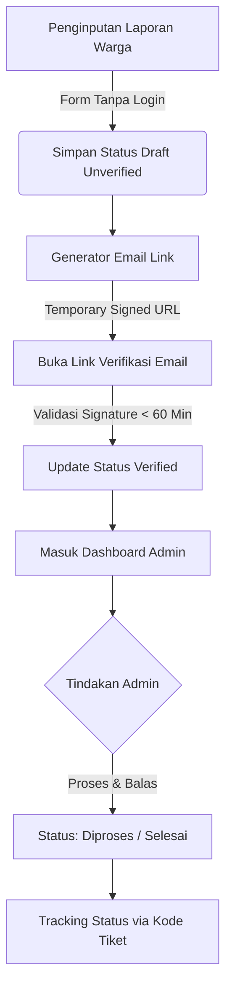
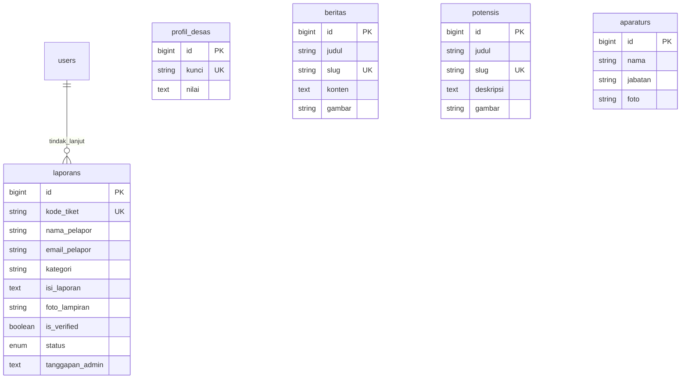

# SIPERDES GUNTURMADU

Sistem Informasi Desa & Platform Pengaduan Masyarakat


---

## 1. Arsitektur Sistem

### 1.1 Struktur Modul Aplikasi

```text
PORTAL PUBLIK DESA GUNTURMADU
├── Informasi Publik & Live Weather Widget
├── Visualizer Demografi Interaktif (Chart.js)
├── Spasial Pemetaan WebGIS (Leaflet Engine)
├── Etalase Produk UMKM & Potensi Desa
├── Galeri Foto & Lightbox Viewer
└── Jurnal Berita Desa
       │
       ▼
SISTEM VERIFIKASI PENGADUAN
├── Form Laporan Warga (Tanpa Akun)
├── Engine Temporary Signed URL
└── Mailer Verifikasi Email (Timeout 60 Menit)
       │
       ▼
PANEL KENDALI ADMIN
├── Dashboard Monitoring & Analitik
├── Manajemen Status Laporan Warga
└── Studio Pemrosesan Media (Cropper.js & Intervention Image)
```

### 1.2 Alur Verifikasi Pengaduan Warga



---

## 2. Spesifikasi Fitur

### 2.1 Modul Publik dan Verifikasi

* **Auth Pengaduan (Temporary Signed URL):** Otentikasi laporan warga tanpa pendaftaran akun.
* **Pelacakan Tiket (Unique Hash String):** Kode unik tracking status pengaduan (Contoh: LPR-X8A2K9).
* **Weather Widget (Open-Meteo API):** Pembaruan kondisi cuaca lokasi desa secara berkala.
* **WebGIS Spasial (Leaflet Engine):** Pemetaan lokasi fasilitas umum dan rute navigasi.

### 2.2 Modul Pemrosesan Media & Demografi

* **Image Cropper (Cropper.js):** Pemotongan foto profil aparatur desa rasio 1:1 di browser.
* **Image Compression (Intervention Image v3):** Kompresi otomatis .jpg max 1200px dengan kualitas 70%.
* **Focal Adjustment (Custom Object Position):** Penyesuaian titik fokus gambar (top, center, bottom).
* **Visualizer Data (Chart.js v4):** Grafik demografi kependudukan terintegrasi guardrail script.

---

## 3. Skema Relasi Database (ERD)



---

## 4. Panduan Instalasi

### 4.1 Kloning Repositori & Install Dependensi

```bash
git clone [https://github.com/username/siperdes-gunturmadu.git](https://github.com/username/siperdes-gunturmadu.git)
cd siperdes-gunturmadu
composer install
npm install
```

### 4.2 Konfigurasi Environment

```bash
cp .env.example .env
php artisan key:generate
```

Konfigurasi `.env`:

```env
DB_CONNECTION=mysql
DB_HOST=127.0.0.1
DB_PORT=3306
DB_DATABASE=db_gunturmadu
DB_USERNAME=root
DB_PASSWORD=

MAIL_MAILER=smtp
MAIL_HOST=smtp.gmail.com
MAIL_PORT=587
MAIL_USERNAME=email-desa@gmail.com
MAIL_PASSWORD=app-specific-password
MAIL_ENCRYPTION=tls
MAIL_FROM_ADDRESS="no-reply@gunturmadu.desa.id"
MAIL_FROM_NAME="Desa Gunturmadu"
```

### 4.3 Migrasi Database & Storage Symlink

```bash
php artisan migrate --seed
php artisan storage:link
```

### 4.4 Menjalankan Server Lokal

```bash
# Terminal 1 - Backend Server
php artisan serve

# Terminal 2 - Frontend Asset Compiler
npm run dev
```

---

## 5. Tech Stack Summary

* **Backend Core:** Laravel 11.x (PHP >= 8.2)
* **Frontend UI:** Tailwind CSS v3, Alpine.js v3
* **Data Visualization:** Chart.js v4
* **Media Engine:** Intervention Image v3 (GD Driver), Cropper.js
* **Maps & Weather:** Leaflet WebGIS Engine, Open-Meteo API
* **Security Layer:** Laravel Breeze, Signed Temporary URLs, CSRF Protection
